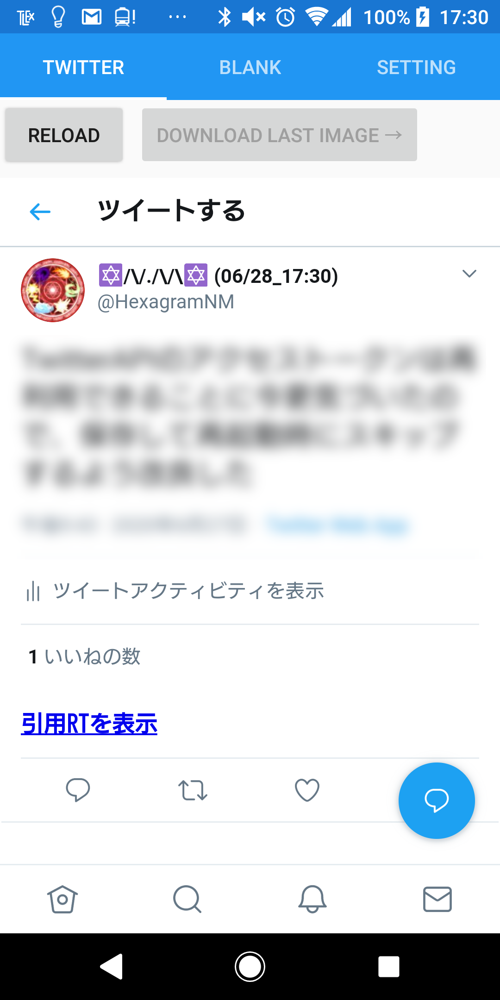
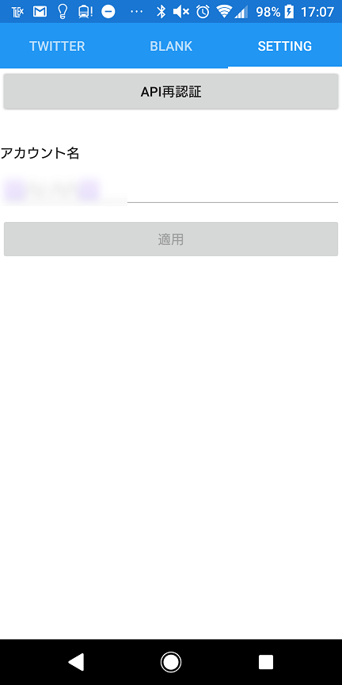
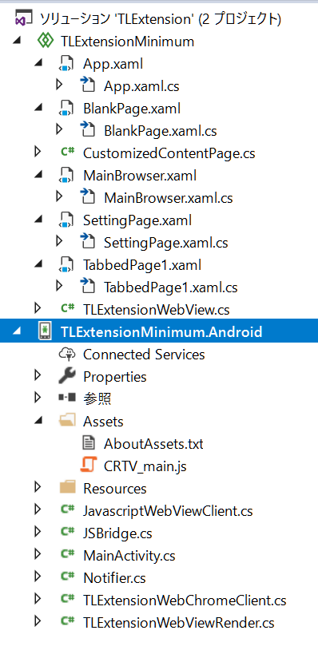

# TLExtension

## 概要

Twitter Liteに対し、下記の拡張を行ったXamarin.Forms製のAndroidアプリケーションです。その他[CoreTweet](https://github.com/CoreTweet/CoreTweet/wiki/Home(%E6%97%A5%E6%9C%AC%E8%AA%9E)), PCLStorageを使用しております。

- アカウント名の横にTwitterを見ていた時刻の表示（アカウント名が「Settingで指定したアカウント名」+ 「最後にTwitterを見ていた時刻」になります。）

- 引用RT検索機能（ツイート表示画面に引用RT検索のリンクが追加されます。）

    - 公式の機能とは違い、1番上以外の引用RTに含まれる重複する元ツイートは非表示になります。
    
    - 公式の検索を利用するので、「話題になっている順」、「最新順」と順番をソートすることができます。

- 画像や動画のダウンロード（画像の拡大表示、動画のあるツイートの表示画面に移動すると、"DOWNLOAD LAST IMAGE"の右に表示したメディアが表示され、ボタンを押すとそのメディアがダウンロードされます。）

- Twitter REST APIとの認証機能（BlankのページのところにAPIを使用した拡張をこのアプリに追加実装することができます。）

このソースコードを使用してTwitterアプリを作成し、公開する場合は、このページを紹介していただけると助かります。

## 導入方法（Visual Studio 2017で実装しております。）

1. [Twitterの開発者ページ](https://developer.twitter.com/en/apps)から新規アプリを作成し、Consumer KeyとConsumer Secretを生成します。

2. Visual StudioにXamarinを導入します（Visual Studio Installerのところで「.NETによるモバイル開発」にチェックを入れれば大丈夫だと思います。）

3. Visual Studioでプロジェクトを作成します。テンプレートは"Visual C#"→"Android"→"Android XAMLアプリ (Xamarin.Forms)"を指定してください。

4. "プロジェクト"→"NuGetのパッケージ管理"から、CoreTweetとPCLStorageをインストールしてください。

5. プロジェクトのFormsフォルダのソースコードをこのリポジトリのTLExtensionフォルダ内のソースコードに置き換え、
プロジェクトのAndroidフォルダのC#ソースコードをこのリポジトリのTLExtension.Androidフォルダ内のソースコードに置き換えます。

6. プロジェクトのAndroidフォルダ内にあるAssetsフォルダに、このリポジトリのTLExtension.Android/Assets/CRTV_main.jsを追加します。
最終的に、プロジェクトのファイル構成が以下のようになっていれば、大丈夫です。

7. TLExtension/App.xaml.cs内のAppクラスにstatic変数`cKey`と`cSecret`があるので、`cKey`に1で生成したConsumer Keyを、`cSecret`に1で生成した
Consumer Secretを入れてください。

8. Android側プロジェクトのプロパティでAndroidマニフェストを編集し、READ_EXTERNAL_STORAGEとWRITE_EXTERNAL_STORAGEのアクセス許可をONにします。

9. ビルドします。

## 追加拡張の仕方

BLANKのページにREST APIを使用した拡張機能を追加することができます。また、BLANKのページを増やし、複数機能を同時に追加することもできます。

### Blankページの編集

BLANKページには独自クラス`CustomizedContentPage`を使用しておりますが、このクラスはXamarin.Formsの`ContentPage`クラスを継承しておりますので、
通常の`ContentPage`と同じようにUIパーツを追加することができます。

### Blankページの追加

1. BlankPage.xamlとBlankPage.xaml.csを複製し、それぞれBlankPageとなっている箇所を別名に書き換えます。（仮に書き換えた別名を`BlankPage2`とします。）

2. TabbedPage1.xamlの`<local:BlankPage Title="Blank" />`の次の行に`<local:BlankPage2 Title="Blank2" />`を追加します。

これで、Blank2という新しいタブができ、BlankPage2がアプリケーションに追加されます。

### Blankページの機能追加のやり方

App.xaml.csの`App`クラス、CustomizedContentPage.cs内の`CustomizedContentPage`クラスにあるメソッド、変数を利用して、機能を追加します。

## Blankページで使用できる`App`クラス、`CustomizedContent`クラスの変数、メソッド

### `bool CustomizedContent.authorized`

REST APIの認証が完了するとtrueに、そうでなければfalseになります。これがfalseの時は、後述の`App.t`はnullとなります。

### `static CoreTweet.Tokens App.t`

REST APIを操作するために必要なトークンが格納され、このトークンを利用して、[CoreTweet](https://github.com/CoreTweet/CoreTweet/wiki/Home(%E6%97%A5%E6%9C%AC%E8%AA%9E))の機能を使用することができます。

### `static void App.addCustomSetting(View view)`

※*使用する場合はBlankクラスのコンストラクタで使用してください。*
Blankページに追加する機能の設定をSettingページに追加するために使用します。引数で指定したUIパーツをSettingページに追加します。

### `static void App.registerStartEvent(StartEventHandler action)`

アプリケーション起動時に行うイベントを追加します。
このアプリでのEventHandlerは引数はもたせていないので、`()=>{ action;action;action; }`のような形で引数を与えればOKです。

### `static void App.registerStopEvent(StopEventHandler action)`

アプリケーション停止時（別のアプリを開くなどの時）に行うイベントを追加します。

### `static void App.registerRestartEvent(RestartEventHandler action)`

アプリケーション再起動時（別アプリからの復帰時）に行うイベントを追加します。

### `static void App.registerAuthorizedEvent(AuthorizedEventHandler action)`

REST APIの認証が完了した際に行うイベントを追加します。

### `static Page App.getContentPage(string className)`

TabbedPage1に登録された、指定したクラス名のページを返します。

### `static void App.openUrl(string url)`

Twitterブラウザにページを切り替えつつ、指定したurlのページをTwitterブラウザに表示します。
Twitter外のURLを指定した場合は、Twitterブラウザには表示せず、Chromeなどの既定のブラウザで開きます。

### `static void App.openBrowser()`

Twitterブラウザにページを切り替えます。

### `static void App.notify(string title, string body, int id)`

アプリケーションから通知を発生させます。通知のタイトルは`title`に、本文は`body`に指定します。
すでに同じidの通知をしていた場合は、この通知の発生により同じidの通知は上書きされます。
